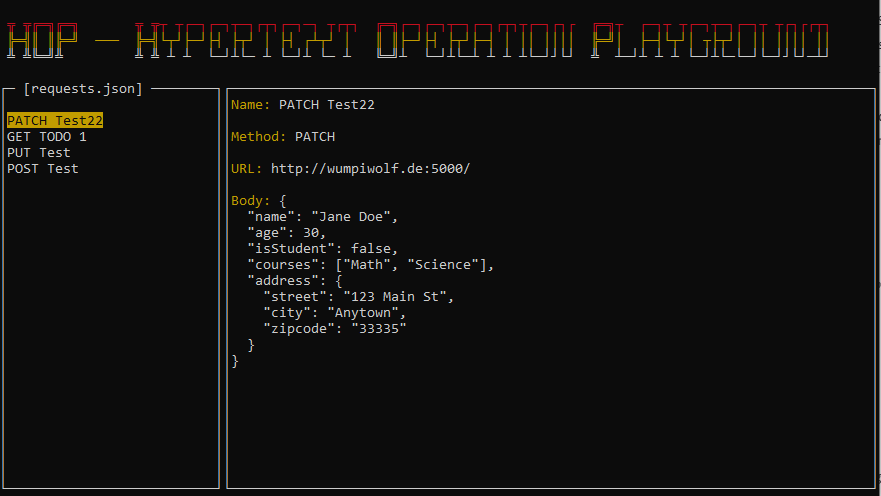

# hop 🐺

**hop** is a simple interactive command-line HTTP client written in Go.  
All requests are stored in a `requests.json` file and can be edited, cloned, deleted, and executed directly from the terminal.  

 <!-- Optional: add a screenshot here -->

---

## ✨ Features

- 📂 Persist requests in `requests.json`
- ✏️ Edit requests directly in the terminal (Name, URL, Method, Body, Headers)
- ➕ Clone requests
- ❌ Delete requests
- ⬆️⬇️ Navigate using arrow keys
- 🖱️ Support for **custom headers** (Key=Value format)
- 🔄 Supports **GET/POST/PUT/DELETE**
- 🖥️ ANSI terminal UI with banner display
- ⚡ Fire requests instantly

---

## 🎹 Keyboard Controls

| Key             | Action                                      |
|-----------------|---------------------------------------------|
| `↑` / `↓`       | Navigate through requests/fields            |
| `Enter`         | Send request or edit field                  |
| `e`             | Enter edit mode                             |
| `c`             | Clone selected request                      |
| `Del`           | Delete selected request                     |
| `ESC`           | Exit edit mode / quit program               |
| `F1`            | Show help                                   |

---

## 📦 Installation

### Requirements
- Go >= 1.21
- Git

### Steps
```bash
# Clone repository
git clone https://github.com/yourname/hop.git
cd hop

# Fetch dependencies
go mod tidy

# Build
go build -o hop

# Run
./hop
```

---

## 📝 Example `requests.json`

```json
[
  {
    "name": "GET Google",
    "url": "http://www.google.de",
    "method": "GET",
    "headers": {
      "Accept-Language": "en-US"
    },
    "body": ""
  },
  {
    "name": "POST Example",
    "url": "https://jsonplaceholder.typicode.com/posts",
    "method": "POST",
    "headers": {
      "Content-Type": "application/json"
    },
    "body": "{\"title\":\"foo\",\"body\":\"bar\",\"userId\":1}"
  }
]
```

---

## ⚡ Roadmap / Ideas
- [ ] Tab support (multiple workspaces)
- [ ] Syntax highlighting for JSON bodies
- [ ] Import/Export requests (Postman Collection, cURL)
- [ ] Extended authentication (OAuth2, Bearer Tokens)

---

## 🤝 Contributing
Pull requests are welcome!  
If you have a feature request or found a bug, feel free to open an [issue](https://github.com/yourname/hop/issues).

---

## 📜 License
MIT License © 2025 [Artem Schmieder]
